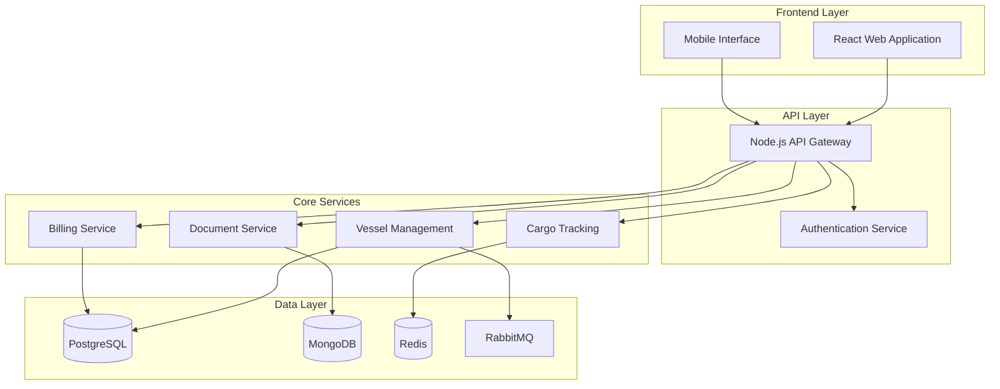
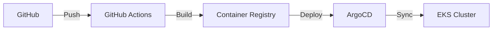

# Port Community System (PCS)

[](https://github.com/port-community-system/pcs/actions)
[](https://sonarcloud.io/dashboard?id=pcs)
[](https://sonarcloud.io/dashboard?id=pcs)

<!-- mermaid-js v9.0.0 -->
<!-- markdown-toc v1.2.0 -->

## Table of Contents

- [Overview](#overview)
- [System Architecture](#system-architecture)
- [Getting Started](#getting-started)
- [Development Guide](#development-guide)
- [Security](#security)
- [Deployment](#deployment)
- [Monitoring](#monitoring)
- [Contributing](#contributing)
- [License](#license)

## Overview

The Port Community System (PCS) is a comprehensive digital platform designed to streamline and automate port operations through seamless integration of various stakeholders including terminal operators, shipping lines, customs authorities, freight forwarders, and port authorities.

### Key Features

- Digital management of ship calls and port operations
- Real-time cargo and container tracking
- EDIFACT-compliant document exchange
- Automated billing and payment processing
- Role-based access control and security
- Integration with external systems via standardized APIs

### Success Metrics

- 50% reduction in document processing time
- 30% decrease in cargo dwell time
- 40% reduction in gate transaction time
- 99.9% system availability
- <2 second response time for 95% of transactions
- Support for 1000+ concurrent users

## System Architecture



### Core Components

- **API Gateway**: Node.js/Express service handling routing and authentication
- **Core Services**: Java 17/Spring Boot microservices for business logic
- **Document Service**: Python 3.9/FastAPI for EDIFACT processing
- **Frontend**: React 18/TypeScript progressive web application
- **Mobile Interface**: React Native mobile application

### Infrastructure

- AWS EKS for container orchestration
- PostgreSQL 15 for transactional data
- MongoDB 6.0 for document storage
- Redis 7.0 for caching
- RabbitMQ 3.11 for message queuing

## Getting Started

### Prerequisites

- Docker 23.0+
- Node.js 18.x LTS
- Java 17 LTS
- Python 3.9+
- AWS CLI v2
- kubectl 1.26+
- Helm 3.11+

### Local Development Setup

1. Clone the repository:
```bash
git clone https://github.com/port-community-system/pcs.git
cd pcs
```

2. Install dependencies:
```bash
# Frontend dependencies
cd web && npm install

# Backend dependencies
cd ../backend && ./mvnw install

# Document service dependencies
cd ../document-service && pip install -r requirements.txt
```

3. Start local development environment:
```bash
docker-compose up -d
```

4. Access local environment:
- Web Application: http://localhost:3000
- API Documentation: http://localhost:8080/swagger-ui.html
- Monitoring Dashboard: http://localhost:9090

## Development Guide

### Code Structure

```
pcs/
├── web/                 # React frontend application
├── backend/            # Spring Boot backend services
├── document-service/   # Python document processing service
├── infrastructure/     # Kubernetes and deployment configs
├── scripts/           # Development and deployment scripts
└── docs/              # Additional documentation
```

### Coding Standards

- Follow language-specific style guides:
  - Java: Google Java Style Guide
  - JavaScript/TypeScript: Airbnb Style Guide
  - Python: PEP 8
- Write unit tests for all new features
- Document all public APIs
- Use conventional commits

## Security

### Authentication Methods

- OAuth 2.0/OIDC with Auth0
- JWT tokens for API authentication
- mTLS for service-to-service communication
- API keys for external integrations
- MFA for administrative access

### Authorization

- Role-based access control (RBAC)
- Resource-level permissions
- Audit logging
- Data encryption at rest and in transit

## Deployment

### CI/CD Pipeline



### Environments

- Development: Feature testing and integration
- Staging: UAT and performance testing
- Production: Live operations
- DR: Disaster recovery environment

## Monitoring

- Prometheus for metrics collection
- Grafana for visualization
- ELK Stack for log aggregation
- Jaeger for distributed tracing
- PagerDuty for alerting

## Contributing

1. Fork the repository
2. Create a feature branch
3. Commit your changes
4. Push to the branch
5. Create a Pull Request

## License

Copyright © 2024 Port Community System. All rights reserved.