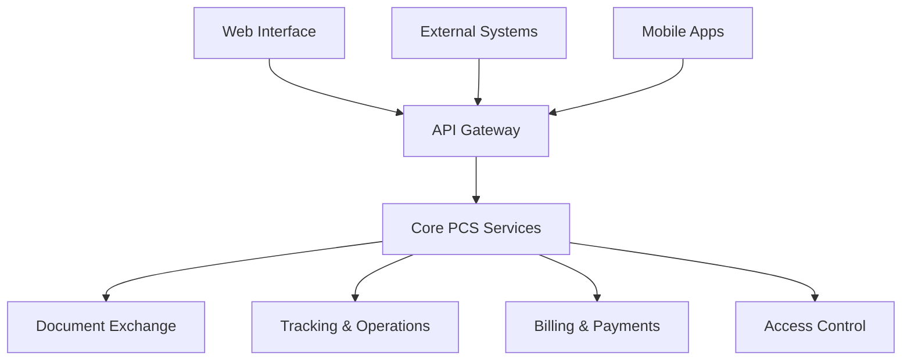
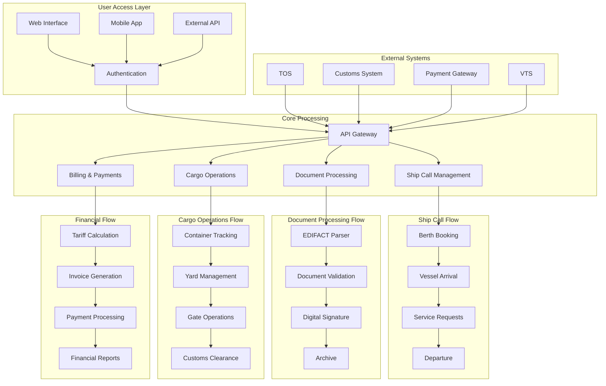
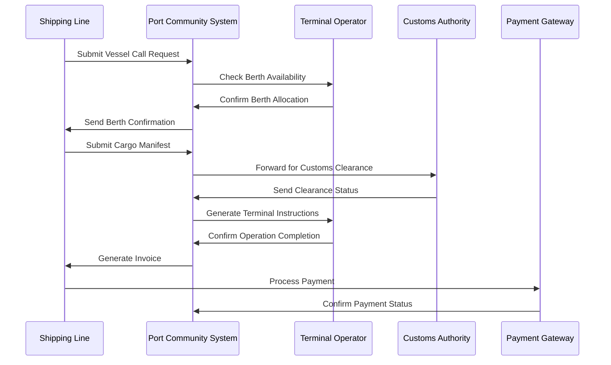
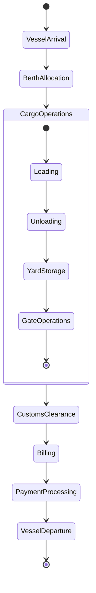
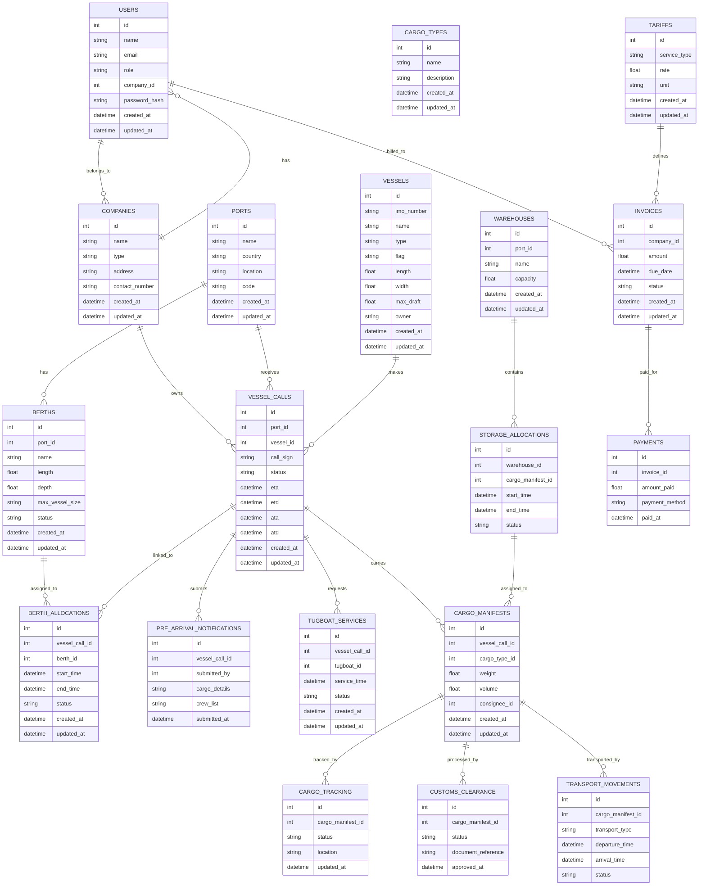
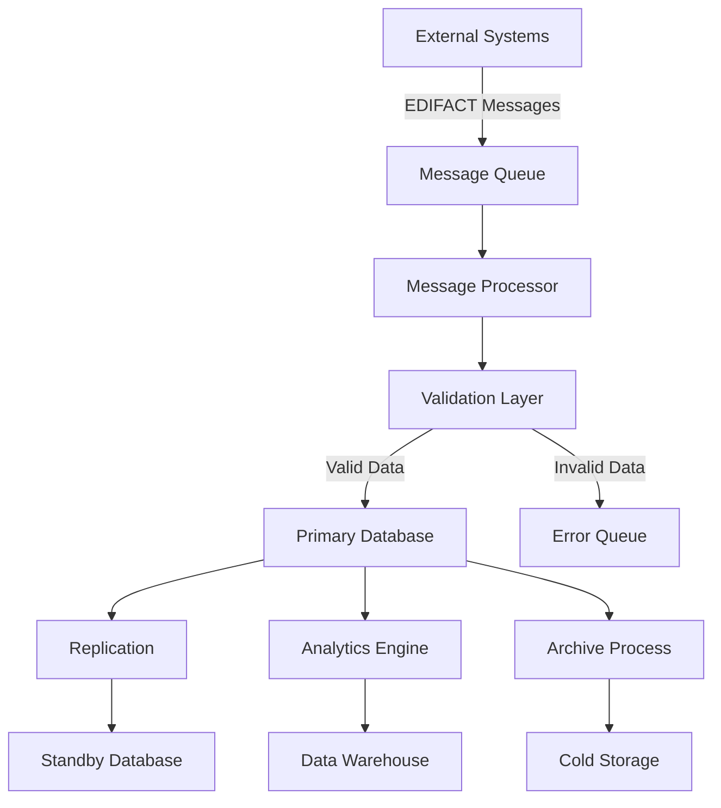

# Product Requirements Document (PRD)

# 1. INTRODUCTION

## 1.1 Purpose

This Product Requirements Document (PRD) specifies the functional and non-functional requirements for the Port Community System (PCS). It serves as the primary reference document for:

- Development and QA teams implementing the system
- Project stakeholders validating system capabilities
- System architects designing the technical infrastructure
- Port authorities and stakeholders evaluating system compliance
- Integration partners developing connected systems

## 1.2 Scope

The Port Community System is a comprehensive digital platform that streamlines port operations and facilitates collaboration between various stakeholders in the maritime supply chain. The system encompasses:

### Core Capabilities

- End-to-end ship call and voyage management
- Real-time cargo and container tracking
- Digital document exchange using EDIFACT standards
- Automated berth and yard space allocation
- Gate operations and access control management
- Digital customs declarations and manifest processing
- Comprehensive billing and invoicing

### Key Stakeholders

- Terminal operators
- Shipping lines
- Customs authorities
- Freight forwarders
- Port authorities
- Trucking companies
- Cargo owners

### System Benefits

- Reduced manual documentation and paperwork
- Improved operational efficiency and resource utilization
- Enhanced visibility across the supply chain
- Streamlined customs and regulatory compliance
- Automated billing and payment processing
- Real-time communication and data exchange
- Standardized EDI message handling

### Technical Scope

- Web-based application with responsive design
- RESTful API infrastructure
- EDIFACT message support (IFTSTA, IFTMBC, BAPLIE, COARRI)
- Role-based access control
- Cloud and on-premise deployment options
- Integration with external systems and payment gateways

# 2. PRODUCT DESCRIPTION

## 2.1 Product Perspective

The Port Community System operates as a centralized digital platform within the broader maritime logistics ecosystem. It interfaces with:

- Terminal Operating Systems (TOS)
- Customs Management Systems
- Vessel Traffic Services (VTS)
- Enterprise Resource Planning (ERP) systems
- National Single Window platforms
- Bank payment gateways
- External tracking and logistics systems

The system follows a modular architecture with the following high-level components:

## 2.2 Product Functions

- Vessel Management

  - Berth booking and allocation
  - Ship call registration
  - Vessel schedule management
  - Port service requests

- Cargo Operations

  - Container tracking and status updates
  - Cargo manifest processing
  - Dangerous goods declarations
  - Load/discharge operations management

- Document Processing

  - EDIFACT message handling
  - Digital document generation
  - Electronic signature integration
  - Document workflow management

- Financial Operations

  - Automated invoice generation
  - Dynamic tariff calculations
  - Payment processing
  - Financial reporting

## 2.3 User Characteristics

| User Type | Characteristics | Technical Expertise | Primary Functions |
| --- | --- | --- | --- |
| Port Authority Staff | Maritime operations knowledge | Moderate | System administration, oversight |
| Terminal Operators | Container handling expertise | High | Berth/yard management |
| Shipping Lines | Vessel operations knowledge | Moderate | Vessel/cargo documentation |
| Customs Officers | Regulatory expertise | Moderate | Clearance processing |
| Freight Forwarders | Logistics expertise | Low to Moderate | Cargo tracking, documentation |
| Trucking Companies | Transport operations | Low | Gate appointments, cargo pickup |
| System Administrators | IT expertise | High | System maintenance |

## 2.4 Constraints

- Technical Constraints

  - Must support legacy EDIFACT message formats
  - Required compatibility with existing port infrastructure
  - Internet connectivity dependencies
  - Database scalability limitations

- Regulatory Constraints

  - Compliance with maritime regulations
  - Data privacy requirements (GDPR)
  - Local customs regulations
  - Electronic signature laws

- Operational Constraints

  - 24/7 availability requirement
  - Maximum system downtime limits
  - Data retention policies
  - Backup frequency requirements

## 2.5 Assumptions and Dependencies

### Assumptions

- Stable internet connectivity at port facilities
- User access to web-enabled devices
- Stakeholder adoption of digital processes
- Availability of technical support staff
- Regular system maintenance windows

### Dependencies

- Integration capabilities of external systems
- EDIFACT message format stability
- Payment gateway availability
- Customs system interfaces
- Terminal operating system APIs
- Network infrastructure reliability
- Cloud service provider uptime

# 3. PROCESS FLOWCHART

# 4. FUNCTIONAL REQUIREMENTS

## 4.1 Vessel Management

### ID: VM-001

### Description

Core vessel management functionality including berth booking, ship call registration, and vessel tracking

### Priority

High

### Requirements

| ID | Requirement | Description | Priority |
| --- | --- | --- | --- |
| VM-001.1 | Berth Booking | Allow users to request and book berth spaces with conflict detection | High |
| VM-001.2 | Ship Call Registration | Digital registration of vessel calls with IMO number validation | High |
| VM-001.3 | Vessel Tracking | Real-time vessel position tracking integrated with VTS | Medium |
| VM-001.4 | Service Requests | Management of vessel-related service requests (pilotage, towage) | Medium |
| VM-001.5 | Schedule Management | Maintenance of vessel arrival and departure schedules | High |

## 4.2 Cargo Operations

### ID: CO-001

### Description

Comprehensive cargo and container tracking functionality with yard management

### Priority

High

### Requirements

| ID | Requirement | Description | Priority |
| --- | --- | --- | --- |
| CO-001.1 | Container Tracking | Real-time tracking of container status and location | High |
| CO-001.2 | Yard Management | Digital management of container yard spaces and movements | High |
| CO-001.3 | Load/Discharge Planning | Planning and execution of container loading/discharge operations | High |
| CO-001.4 | Dangerous Goods | Special handling and documentation for dangerous goods | High |
| CO-001.5 | Cargo Manifest | Digital processing of cargo manifests with validation | Medium |

## 4.3 Document Exchange

### ID: DE-001

### Description

Electronic document processing and EDIFACT message handling

### Priority

High

### Requirements

| ID | Requirement | Description | Priority |
| --- | --- | --- | --- |
| DE-001.1 | EDIFACT Processing | Support for IFTSTA, IFTMBC, BAPLIE, COARRI messages | High |
| DE-001.2 | Document Generation | Automated generation of shipping documents and reports | High |
| DE-001.3 | Digital Signatures | Integration of electronic signature capabilities | Medium |
| DE-001.4 | Document Workflow | Configurable document approval and routing workflows | Medium |
| DE-001.5 | Archive Management | Secure storage and retrieval of historical documents | Low |

## 4.4 Gate Operations

### ID: GO-001

### Description

Automation of port gate operations and access control

### Priority

High

### Requirements

| ID | Requirement | Description | Priority |
| --- | --- | --- | --- |
| GO-001.1 | Gate Appointments | Digital scheduling of truck appointments | High |
| GO-001.2 | Access Control | RFID/barcode-based vehicle and driver identification | High |
| GO-001.3 | Equipment Tracking | Tracking of handling equipment entering/leaving port | Medium |
| GO-001.4 | Weight Bridge | Integration with weight bridge systems | Medium |
| GO-001.5 | Gate OCR | Optical character recognition for container numbers | Low |

## 4.5 Financial Operations

### ID: FO-001

### Description

Comprehensive billing and payment processing functionality

### Priority

High

### Requirements

| ID | Requirement | Description | Priority |
| --- | --- | --- | --- |
| FO-001.1 | Tariff Management | Configuration and management of port service tariffs | High |
| FO-001.2 | Invoice Generation | Automated generation of invoices for services rendered | High |
| FO-001.3 | Payment Processing | Integration with payment gateways for online payments | High |
| FO-001.4 | Credit Management | Management of customer credit limits and terms | Medium |
| FO-001.5 | Financial Reporting | Generation of financial reports and statements | Medium |

## 4.6 Customs Integration

### ID: CI-001

### Description

Integration with customs systems for clearance processing

### Priority

High

### Requirements

| ID | Requirement | Description | Priority |
| --- | --- | --- | --- |
| CI-001.1 | Declaration Processing | Digital submission of customs declarations | High |
| CI-001.2 | Clearance Management | Processing of customs clearance requests | High |
| CI-001.3 | Risk Assessment | Integration with customs risk assessment systems | Medium |
| CI-001.4 | Duty Calculation | Automated calculation of customs duties and taxes | Medium |
| CI-001.5 | Inspection Management | Coordination of customs inspection activities | Low |

# 5. NON-FUNCTIONAL REQUIREMENTS

## 5.1 Performance Requirements

| Requirement | Description | Target Metric |
| --- | --- | --- |
| Response Time | Maximum time for page loads and API responses | \< 2 seconds for 95% of requests |
| API Throughput | Number of concurrent API requests handled | 1000 requests/second minimum |
| Database Performance | Maximum query execution time | \< 500ms for 90% of queries |
| File Processing | EDIFACT message processing time | \< 5 seconds per message |
| Batch Processing | Bulk operation completion time | \< 30 minutes for 100,000 records |
| Memory Usage | Maximum memory consumption per instance | \< 8GB RAM |
| CPU Utilization | Average CPU usage under normal load | \< 70% |

## 5.2 Safety Requirements

| Requirement | Description |
| --- | --- |
| Data Backup | Daily incremental backups, weekly full backups with 30-day retention |
| Failover System | Automatic failover to secondary systems within 5 minutes |
| Data Recovery | Recovery Point Objective (RPO) of 1 hour, Recovery Time Objective (RTO) of 4 hours |
| Error Handling | Graceful degradation of services with user notification |
| Transaction Safety | ACID compliance for all financial transactions |
| Audit Trail | Complete logging of all system modifications and access attempts |
| Environment Monitoring | Real-time monitoring of system health with automated alerts |

## 5.3 Security Requirements

| Category | Requirements |
| --- | --- |
| Authentication | - Multi-factor authentication for administrative access - SSO integration with enterprise systems - Password policy enforcement - Session timeout after 30 minutes |
| Authorization | - Role-based access control (RBAC) - Principle of least privilege - Regular access review and audit - IP-based access restrictions |
| Data Protection | - TLS 1.3 for all data in transit - AES-256 encryption for sensitive data at rest - Secure key management system - Regular security patches |
| Network Security | - Web Application Firewall (WAF) - DDoS protection - Network segmentation - Regular penetration testing |
| Compliance | - GDPR compliance for EU data - ISO 27001 certification - Regular security audits - Data retention policies |

## 5.4 Quality Requirements

### 5.4.1 Availability

- System uptime of 99.9% (excluding planned maintenance)
- Maximum planned downtime of 4 hours per month
- 24/7 system monitoring and support
- Automated health checks every 5 minutes

### 5.4.2 Maintainability

- Modular architecture for easy component replacement
- Comprehensive API documentation
- Automated deployment processes
- Regular code reviews and updates
- Technical debt monitoring and management

### 5.4.3 Usability

- Intuitive user interface following material design principles
- Maximum of 3 clicks to reach any function
- Support for multiple languages
- Context-sensitive help system
- Mobile-responsive design
- Accessibility compliance with WCAG 2.1 Level AA

### 5.4.4 Scalability

- Horizontal scaling capability up to 200% peak load
- Auto-scaling based on resource utilization
- Database partitioning for large datasets
- Load balancing across multiple servers
- Caching strategy for frequently accessed data

### 5.4.5 Reliability

- Mean Time Between Failures (MTBF) \> 720 hours
- Mean Time To Repair (MTTR) \< 2 hours
- Automated system health monitoring
- Fault tolerance for critical components
- Data consistency checks and validation

## 5.5 Compliance Requirements

| Category | Requirements |
| --- | --- |
| Maritime Standards | - Compliance with IMO FAL Convention - Support for EDIFACT standards - Adherence to SOLAS regulations |
| Data Privacy | - GDPR compliance for EU data - Local data protection laws - Privacy impact assessments |
| Security Standards | - ISO 27001 certification - PCI DSS compliance for payment processing - Regular security audits |
| Environmental | - Green computing practices - Energy efficiency monitoring - Environmental impact reporting |
| Industry Specific | - WCO Data Model compliance - Port authority regulations - National single window requirements |

# 6. DATA REQUIREMENTS

## 6.1 Data Models

### 6.1.1 Core Entities

## 6.2 Data Storage

### 6.2.1 Storage Requirements

| Data Type | Storage Method | Retention Period | Backup Frequency |
| --- | --- | --- | --- |
| Transactional Data | Primary Database | 3 years | Daily |
| Document Files | Object Storage | 7 years | Daily |
| Audit Logs | Time-series DB | 5 years | Hourly |
| EDIFACT Messages | Message Queue | 30 days | Real-time |
| User Activity | Analytics DB | 1 year | Weekly |

### 6.2.2 Backup Strategy

- Real-time replication to standby database
- Daily incremental backups
- Weekly full backups
- Monthly archive to cold storage
- Geographic redundancy across multiple regions
- Point-in-time recovery capability

### 6.2.3 Data Partitioning

- Horizontal sharding by date for historical data
- Vertical partitioning for large tables
- Read replicas for reporting queries
- Caching layer for frequently accessed data
- Archive strategy for inactive records

## 6.3 Data Processing

### 6.3.1 Data Flow

### 6.3.2 Data Security Controls

- Encryption at rest using AES-256
- TLS 1.3 for data in transit
- Column-level encryption for sensitive data
- Data masking for non-production environments
- Access control lists for data objects
- Regular data integrity checks
- Automated compliance scanning

### 6.3.3 Data Processing Requirements

| Process Type | SLA | Scalability | Security Level |
| --- | --- | --- | --- |
| EDIFACT Processing | \< 5s | Horizontal | High |
| Document Generation | \< 30s | Vertical | Medium |
| Financial Calculations | \< 1s | Horizontal | High |
| Analytics Processing | \< 5m | Vertical | Medium |
| Archival Operations | \< 4h | Batch | High |

# 7. EXTERNAL INTERFACES

## 7.1 User Interfaces

### 7.1.1 Web Interface Requirements

- Responsive design supporting resolutions from 1024x768 to 4K
- Material Design components for consistent look and feel
- Support for major browsers (Chrome, Firefox, Safari, Edge)
- Maximum page load time of 2 seconds
- Accessibility compliance with WCAG 2.1 Level AA

### 7.1.2 Mobile Interface Requirements

- Progressive Web App (PWA) capabilities
- Native-like experience on iOS and Android
- Offline functionality for critical features
- Touch-optimized interface elements
- Support for device-specific features (camera, GPS)

### 7.1.3 Key Interface Components

| Component | Description | Access Level |
| --- | --- | --- |
| Dashboard | Real-time operational overview | All Users |
| Vessel Management | Ship call and berth management | Port Authority, Terminal Operators |
| Document Center | EDIFACT message handling interface | All Users |
| Financial Portal | Billing and payment management | Finance Users |
| Admin Console | System configuration interface | Administrators |

## 7.2 Hardware Interfaces

### 7.2.1 Gate Control Systems

- Integration with RFID readers (ISO/IEC 14443)
- Support for barcode scanners (1D/2D)
- Connection to weight bridges via RS-232/RS-485
- Interface with OCR cameras for container numbers
- Integration with gate barrier control systems

### 7.2.2 Terminal Equipment

- Real-time data exchange with crane management systems
- Integration with automated guided vehicles (AGV)
- Connection to terminal tractors and reach stackers
- Interface with yard management equipment
- Support for IoT sensors and tracking devices

## 7.3 Software Interfaces

### 7.3.1 External System Integration

| System Type | Interface Method | Protocol | Data Format |
| --- | --- | --- | --- |
| Terminal Operating Systems | REST API | HTTPS | JSON/XML |
| Customs Systems | Web Services | SOAP | XML |
| Vessel Traffic Services | API | TCP/IP | Binary/JSON |
| ERP Systems | REST API | HTTPS | JSON |
| Payment Gateways | REST API | HTTPS | JSON |
| National Single Window | Web Services | SOAP/REST | XML/JSON |

### 7.3.2 Database Interfaces

- PostgreSQL for primary transactional data
- MongoDB for document storage
- Redis for caching and session management
- Elasticsearch for search functionality
- TimescaleDB for time-series data

## 7.4 Communication Interfaces

### 7.4.1 Network Protocols

- HTTPS for web traffic (TLS 1.3)
- WebSocket for real-time updates
- SFTP for bulk file transfers
- SMTP for email notifications
- MQTT for IoT device communication

### 7.4.2 Message Formats

| Message Type | Format | Standard |
| --- | --- | --- |
| EDIFACT Messages | UN/EDIFACT | D.96A, D.01B |
| API Payloads | JSON | OpenAPI 3.0 |
| Document Exchange | XML | xCBL 4.0 |
| IoT Data | Binary/JSON | ISO 15638 |
| Email Notifications | MIME | RFC 5322 |

### 7.4.3 Integration Patterns

- Message Queue using RabbitMQ
- Publish/Subscribe using Apache Kafka
- RESTful API with HAL specification
- Event-driven using WebSocket
- Batch processing via SFTP

### 7.4.4 Security Protocols

- OAuth 2.0 for API authentication
- JWT for token-based authorization
- mTLS for service-to-service communication
- IPSec for VPN connections
- DNSSEC for DNS security

# 8. APPENDICES

## 8.1 GLOSSARY

| Term | Definition |
| --- | --- |
| Berth | A designated location where a vessel may be moored |
| Container Yard | Storage area for containers within a port terminal |
| Demurrage | Charges payable to the shipowner for delay beyond allowed time |
| Gate In/Out | Process of containers entering or leaving port premises |
| Manifest | Document listing cargo carried on a vessel |
| Pilotage | Service where a qualified pilot guides ships in/out of port waters |
| Reefer | Refrigerated container for temperature-controlled cargo |
| Terminal | Designated area within a port for handling cargo operations |
| Towage | Service of towing vessels using tugboats |
| Yard Block | Specific storage location within container yard |

## 8.2 ACRONYMS

| Acronym | Definition |
| --- | --- |
| AGV | Automated Guided Vehicle |
| API | Application Programming Interface |
| EDI | Electronic Data Interchange |
| ERP | Enterprise Resource Planning |
| ETA | Estimated Time of Arrival |
| ETD | Estimated Time of Departure |
| GDPR | General Data Protection Regulation |
| IMO | International Maritime Organization |
| OCR | Optical Character Recognition |
| PCS | Port Community System |
| RFID | Radio-Frequency Identification |
| SOLAS | Safety of Life at Sea |
| TEU | Twenty-foot Equivalent Unit |
| TOS | Terminal Operating System |
| VTS | Vessel Traffic Services |
| WCO | World Customs Organization |

## 8.3 ADDITIONAL REFERENCES

| Category | Reference |
| --- | --- |
| Maritime Standards | - IMO FAL Convention Documentation - SOLAS Convention Guidelines - WCO Safe Framework of Standards |
| Technical Standards | - UN/EDIFACT Directory D.96A - ISO 28005 (Security management systems for ports) - ISO 14443 (RFID Standards) |
| Security Guidelines | - NIST Cybersecurity Framework - ISO 27001 Implementation Guide - OWASP Security Standards |
| Industry Best Practices | - IPCSA Port Community System Guidelines - IAPH Port Guidelines - Digital Container Shipping Standards |
| Regulatory Compliance | - Local Port Authority Regulations - National Single Window Requirements - Regional Data Protection Laws |

## 8.4 EDIFACT MESSAGE SPECIFICATIONS

| Message Type | Purpose | Version | Required Fields |
| --- | --- | --- | --- |
| IFTSTA | Status Report | D.96A | - Message Reference - Status Code - Date/Time - Location |
| IFTMBC | Booking Confirmation | D.96A | - Booking Reference - Vessel Details - Container Details |
| BAPLIE | Bay Plan | D.96A | - Vessel Details - Container Position - Load/Discharge Port |
| COARRI | Container Load/Discharge | D.96A | - Container Number - Operation Type - Timestamp |

## 8.5 API RESPONSE CODES

| Code | Description | Action Required |
| --- | --- | --- |
| 200 | Success | None |
| 201 | Created | None |
| 400 | Bad Request | Check request parameters |
| 401 | Unauthorized | Verify authentication |
| 403 | Forbidden | Check access rights |
| 404 | Not Found | Verify resource exists |
| 409 | Conflict | Resolve data conflict |
| 500 | Server Error | Contact system support |
| 503 | Service Unavailable | Retry after interval |