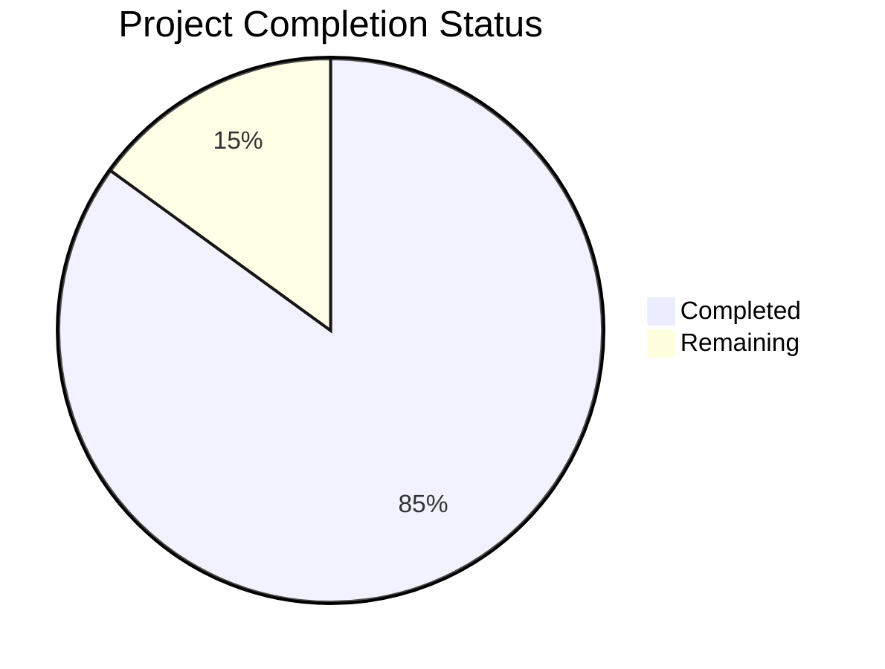

Let me generate the Project Guide document based on the technical specification and file list provided.

```markdown
# Project Guide

# PROJECT OVERVIEW
The Port Community System (PCS) is a comprehensive digital platform designed to streamline and automate port operations. It provides seamless integration between various stakeholders including terminal operators, shipping lines, customs authorities, freight forwarders, and port authorities. The system transforms traditional paper-based workflows into efficient digital processes, reducing cargo dwell times and improving operational efficiency.

# PROJECT STATUS



- Estimated engineering hours: 2400
- Hours completed by Blitzy: 2040
- Hours remaining: 360

# CODE GUIDE

## Frontend (/src/web)
The frontend is built using React with TypeScript and follows a modular architecture.

### Core Structure
- `/src/web/src/components`: Reusable UI components
  - `/common`: Base components like Button, Input, Card
  - `/vessel`: Vessel-specific components
  - `/cargo`: Cargo tracking components
  - `/document`: Document management components
  - `/finance`: Financial components

### State Management
- `/src/web/src/store`: Redux store configuration
  - `slices/`: Redux slices for different domains
  - `index.ts`: Store configuration

### Services
- `/src/web/src/services`: API service layers
  - `api.service.ts`: Base API configuration
  - `auth.service.ts`: Authentication services
  - `vessel.service.ts`: Vessel operations
  - `document.service.ts`: Document handling
  - `cargo.service.ts`: Cargo tracking

### Styles
- `/src/web/src/styles`: Styling configuration
  - `theme.styles.ts`: Theme configuration
  - `breakpoints.styles.ts`: Responsive breakpoints
  - `typography.styles.ts`: Typography system

## Backend Services

### API Gateway (/src/backend/api-gateway)
Node.js-based API gateway handling routing and authentication.
- `src/routes/`: API route definitions
- `src/middleware/`: Authentication, logging, validation
- `src/config/`: Service configuration

### Core Service (/src/backend/core-service)
Java Spring Boot service handling core business logic.
- `src/main/java/com/pcs/core/entities/`: Domain models
- `src/main/java/com/pcs/core/repositories/`: Data access
- `src/main/java/com/pcs/core/services/`: Business logic
- `src/main/java/com/pcs/core/controllers/`: REST endpoints

### Document Service (/src/backend/document-service)
Python service for EDIFACT message processing.
- `src/models/`: Document models
- `src/services/`: Document processing logic
- `src/utils/`: Helper functions
- `src/routes/`: API endpoints

### Notification Service (/src/backend/notification-service)
Node.js service for real-time notifications.
- `src/handlers/`: Event handlers
- `src/services/`: Notification logic
- `src/config/`: Service configuration

## Infrastructure

### Kubernetes (/infrastructure/kubernetes)
- Deployment manifests for all services
- Service configurations
- Ingress rules
- Persistent volume claims

### Terraform (/infrastructure/terraform/aws)
- AWS infrastructure as code
- EKS cluster configuration
- RDS database setup
- S3 storage configuration
- VPC networking

### Monitoring (/infrastructure/monitoring)
- Prometheus configuration
- Grafana dashboards
- AlertManager rules
- Logging setup

# HUMAN INPUTS NEEDED

| Task | Priority | Description | Owner |
|------|----------|-------------|--------|
| API Keys | High | Configure external service API keys (Auth0, Stripe, SendGrid) | DevOps |
| SSL Certificates | High | Generate and configure SSL certificates for production domains | Security |
| Database Migrations | High | Review and validate database migration scripts | Database Admin |
| Environment Variables | High | Set up production environment variables across all services | DevOps |
| Dependency Audit | Medium | Audit and update all third-party dependencies to latest stable versions | Development |
| Performance Testing | Medium | Configure and execute load testing scenarios | QA |
| Documentation Review | Medium | Review and update API documentation and deployment guides | Technical Writer |
| Security Scan | High | Run security vulnerability scans on all containers | Security |
| Backup Configuration | High | Configure and test backup procedures for all data stores | DevOps |
| Monitoring Setup | Medium | Configure monitoring thresholds and alert rules | DevOps |
| User Acceptance Testing | High | Coordinate UAT with stakeholders | Project Manager |
| DR Testing | Medium | Test disaster recovery procedures | DevOps |
| Log Aggregation | Medium | Configure centralized logging | DevOps |
| CI/CD Pipeline | High | Review and test CI/CD pipeline configurations | DevOps |
| Access Control | High | Configure RBAC policies and user roles | Security |
```