# Technical Specifications

# 1. INTRODUCTION

## 1.1 EXECUTIVE SUMMARY

The Port Community System (PCS) is a comprehensive digital platform designed to streamline and automate port operations through seamless integration of various stakeholders including terminal operators, shipping lines, customs authorities, freight forwarders, and port authorities. The system addresses the critical challenge of fragmented communication and manual processes in port operations by providing a centralized platform for digital collaboration, document exchange, and real-time operational visibility.

This solution will transform traditional paper-based workflows into efficient digital processes, reducing cargo dwell times, improving resource utilization, and ensuring regulatory compliance while providing real-time visibility across the maritime supply chain.

## 1.2 SYSTEM OVERVIEW

### Project Context

| Aspect | Description |
| --- | --- |
| Business Context | Increasing port congestion and operational inefficiencies require digital transformation of port operations |
| Current Limitations | Manual document processing, siloed stakeholder systems, limited real-time visibility |
| Enterprise Integration | Integration with Terminal Operating Systems (TOS), Customs Management Systems, ERP platforms, and National Single Window |

### High-Level Description

The PCS implements a modular architecture supporting:

- Digital management of ship calls and port operations
- Real-time cargo and container tracking
- EDIFACT-compliant document exchange
- Automated billing and payment processing
- Role-based access control and security
- Integration with external systems via standardized APIs

### Success Criteria

| Category | Metrics |
| --- | --- |
| Operational Efficiency | - 50% reduction in document processing time<br>- 30% decrease in cargo dwell time<br>- 40% reduction in gate transaction time |
| System Performance | - 99.9% system availability<br>- \<2 second response time for 95% of transactions<br>- Support for 1000+ concurrent users |
| Business Impact | - 25% increase in port throughput<br>- 35% reduction in administrative costs<br>- 100% digital document compliance |

## 1.3 SCOPE

### In-Scope Elements

| Category | Components |
| --- | --- |
| Core Features | - Ship call management<br>- Cargo tracking<br>- Document exchange<br>- Berth management<br>- Gate operations<br>- Billing and invoicing |
| User Groups | - Terminal operators<br>- Shipping lines<br>- Customs authorities<br>- Freight forwarders<br>- Port authorities<br>- Trucking companies |
| Technical Scope | - Web application<br>- Mobile interface<br>- RESTful APIs<br>- EDIFACT message support<br>- Payment gateway integration |
| Data Domains | - Vessel operations<br>- Container tracking<br>- Documentation<br>- Financial transactions<br>- Customs declarations |

### Out-of-Scope Elements

- Terminal Operating System (TOS) internal operations
- Vessel Traffic Management System (VTMS) functionality
- Physical security systems integration
- Port equipment maintenance management
- Environmental monitoring systems
- Crew management systems
- Port infrastructure maintenance
- Marine services scheduling

# 2. SYSTEM ARCHITECTURE

## 2.1 High-Level Architecture

The Port Community System follows a modular monolithic architecture with clear domain boundaries to enable future microservices decomposition if needed.

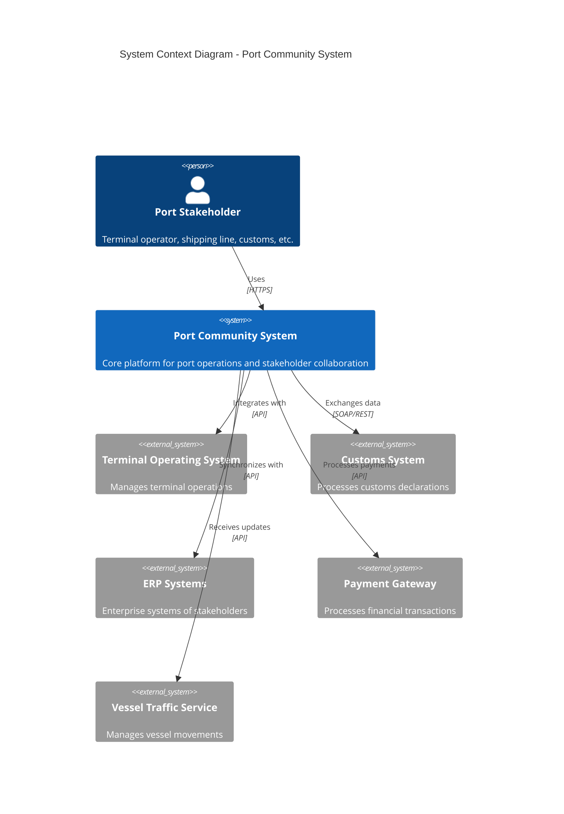

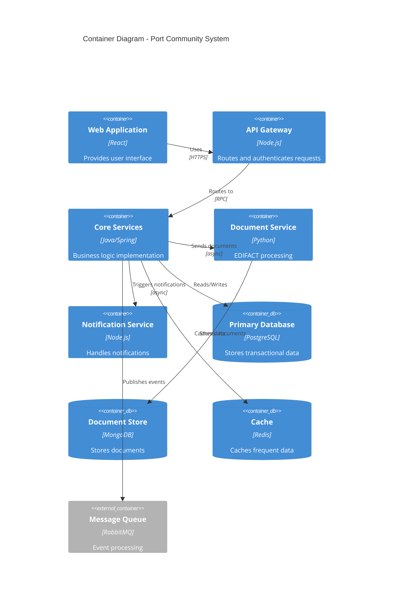

## 2.2 Component Details

### 2.2.1 Core Components

| Component | Purpose | Technology Stack | Scaling Strategy |
| --- | --- | --- | --- |
| API Gateway | Request routing, authentication | Node.js, Express | Horizontal with load balancer |
| Core Services | Business logic processing | Java 17, Spring Boot | Horizontal with session affinity |
| Document Service | EDIFACT message handling | Python 3.9, FastAPI | Horizontal with queue-based workload |
| Notification Service | Alert and message delivery | Node.js, Socket.io | Horizontal with sticky sessions |
| Data Services | Data access and persistence | Spring Data JPA | Vertical with read replicas |

### 2.2.2 Infrastructure Components

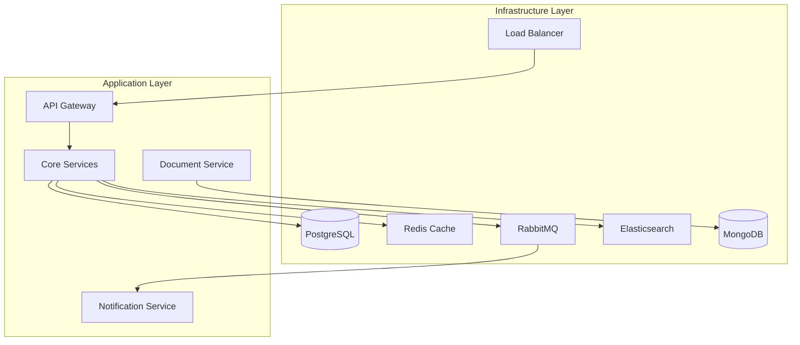

## 2.3 Technical Decisions

### 2.3.1 Architecture Patterns

| Pattern | Implementation | Justification |
| --- | --- | --- |
| Modular Monolith | Domain-driven modules | Simplifies initial development while allowing future decomposition |
| Event-Driven | RabbitMQ | Enables loose coupling and async processing |
| CQRS | Read/Write separation | Optimizes query and command paths |
| Circuit Breaker | Resilience4j | Handles external system failures gracefully |
| API Gateway | Node.js/Express | Centralizes cross-cutting concerns |

### 2.3.2 Data Architecture

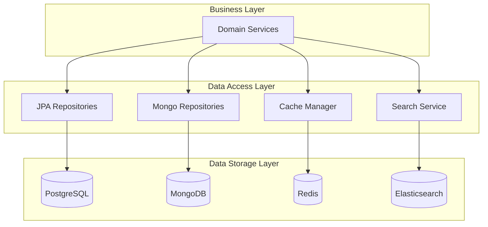

## 2.4 Cross-Cutting Concerns

### 2.4.1 Monitoring and Observability

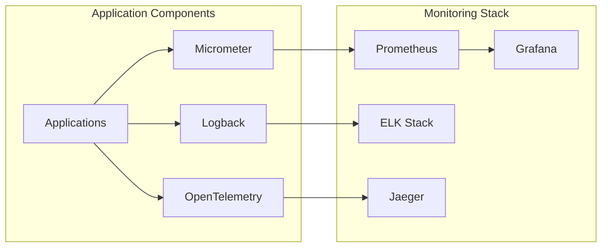

### 2.4.2 Security Architecture

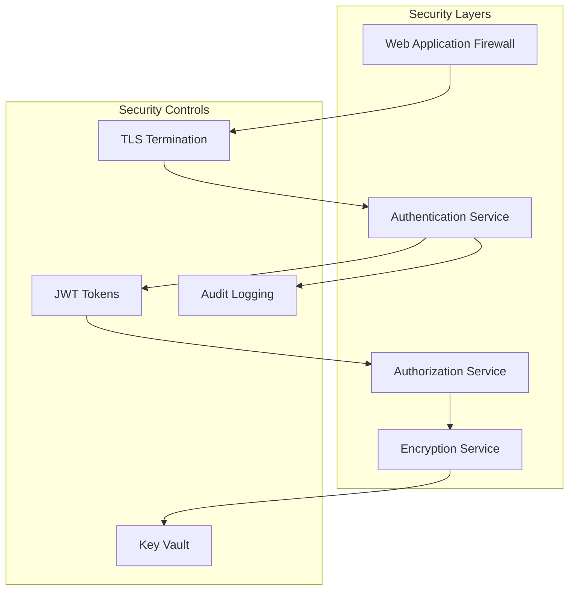

## 2.5 Deployment Architecture

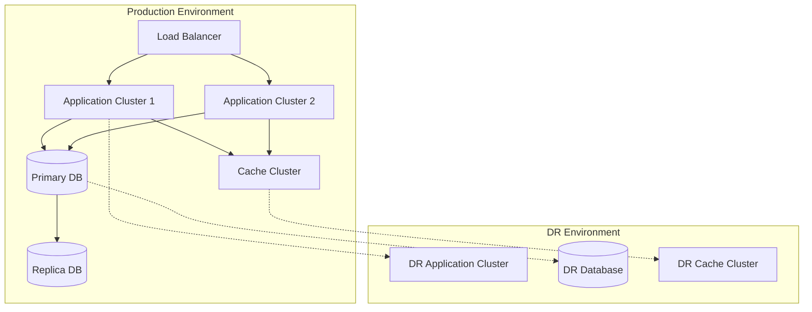

# 3. SYSTEM COMPONENTS ARCHITECTURE

## 3.1 User Interface Design

### 3.1.1 Design System Specifications

| Component | Specification | Details |
| --- | --- | --- |
| Typography | System Font Stack | -Primary: Inter<br>-Secondary: Roboto<br>-Monospace: JetBrains Mono |
| Color Palette | Maritime Theme | -Primary: #003366<br>-Secondary: #0066CC<br>-Accent: #00A3E0<br>-Warning: #FFA500<br>-Error: #DC3545 |
| Layout Grid | 12-column system | -Container max-width: 1440px<br>-Gutter width: 24px<br>-Column width: fluid |
| Spacing Scale | 8px base unit | -xs: 4px<br>-sm: 8px<br>-md: 16px<br>-lg: 24px<br>-xl: 32px |
| Breakpoints | Responsive | -Mobile: 320px<br>-Tablet: 768px<br>-Desktop: 1024px<br>-Wide: 1440px |

### 3.1.2 Component Library

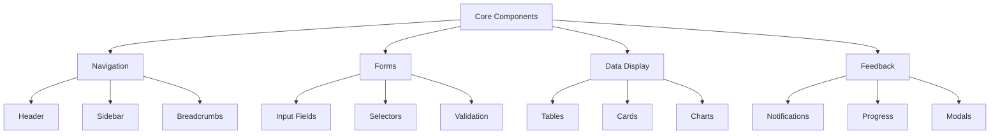

### 3.1.3 Critical User Flows

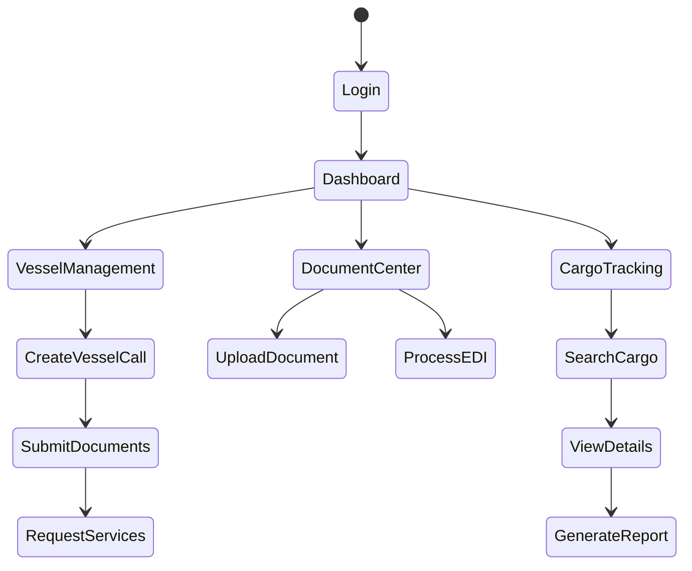

## 3.2 Database Design

### 3.2.1 Schema Design

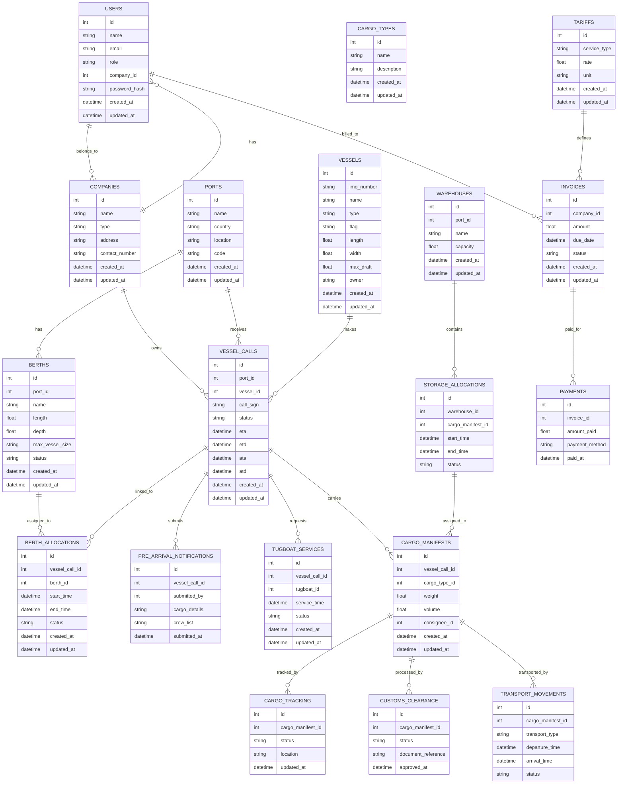

### 3.2.2 Indexing Strategy

| Table | Index Type | Columns | Purpose |
| --- | --- | --- | --- |
| vessel_call | Primary | id | Unique identifier |
| vessel_call | B-tree | (imo_number, eta) | Vessel schedule lookup |
| cargo_manifest | Primary | id | Unique identifier |
| cargo_manifest | Hash | vessel_call_id | Foreign key lookup |
| berth_allocation | B-tree | (start_time, end_time) | Time range queries |

### 3.2.3 Partitioning Strategy

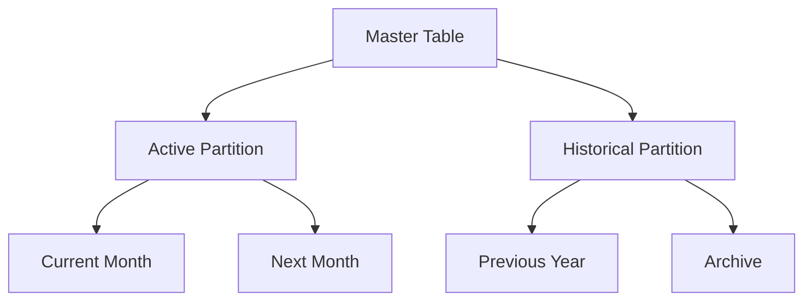

## 3.3 API Design

### 3.3.1 API Architecture

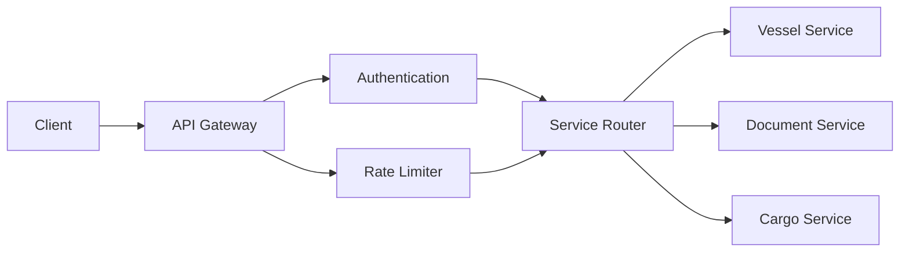

### 3.3.2 Endpoint Specifications

### 3.3.2.**1. Ship Call & Voyage Management**

- `POST /ships` - Register a new ship call

- `GET /ships/{id}` - Retrieve ship details

- `GET /ships` - List all registered ships

- `PUT /ships/{id}` - Update ship information

- `DELETE /ships/{id}` - Remove a ship call

- `POST /voyages` - Create a voyage entry

- `GET /voyages/{id}` - Retrieve voyage details

- `GET /voyages` - List all voyages

- `PUT /voyages/{id}` - Update voyage information

### 3.3.2.**2. Cargo & Container Tracking**

- `POST /cargos` - Register a new cargo

- `GET /cargos/{id}` - Retrieve cargo details

- `GET /cargos` - List all cargo entries

- `PUT /cargos/{id}` - Update cargo information

- `POST /containers` - Register a new container

- `GET /containers/{id}` - Retrieve container details

- `PUT /containers/{id}` - Update container status

### 3.3.2.**3. Electronic Document Exchange (EDIFACT)**

- `POST /edifact/messages` - Send an EDIFACT message

- `GET /edifact/messages/{id}` - Retrieve a message

- `GET /edifact/messages` - List all received messages

### 3.3.2.**4. Invoicing & Billing**

- `POST /invoices` - Generate an invoice

- `GET /invoices/{id}` - Retrieve invoice details

- `GET /invoices` - List all invoices

- `PUT /invoices/{id}/status` - Update invoice status (e.g., paid, pending)

- `POST /payments` - Register a payment

- `GET /payments/{id}` - Retrieve payment details

### 3.3.2.**5. User Interface & Access Control**

- `POST /users` - Register a user

- `GET /users/{id}` - Retrieve user details

- `GET /users` - List all users

- `PUT /users/{id}` - Update user information

- `POST /roles` - Create a new role

- `GET /roles` - List available roles

- `PUT /users/{id}/roles` - Assign roles to users

### 3.3.2.**6. Berth & Terminal Management**

- `POST /terminals` - Create a terminal

- `GET /terminals/{id}` - Retrieve terminal details

- `POST /berths` - Assign a berth

- `GET /berths/{id}` - Retrieve berth details

### 3.3.2.**7. Tracking & Logistics**

- `POST /tracking/events` - Record a tracking event

- `GET /tracking/events/{id}` - Retrieve event details

### 3.3.3 Authentication Flow

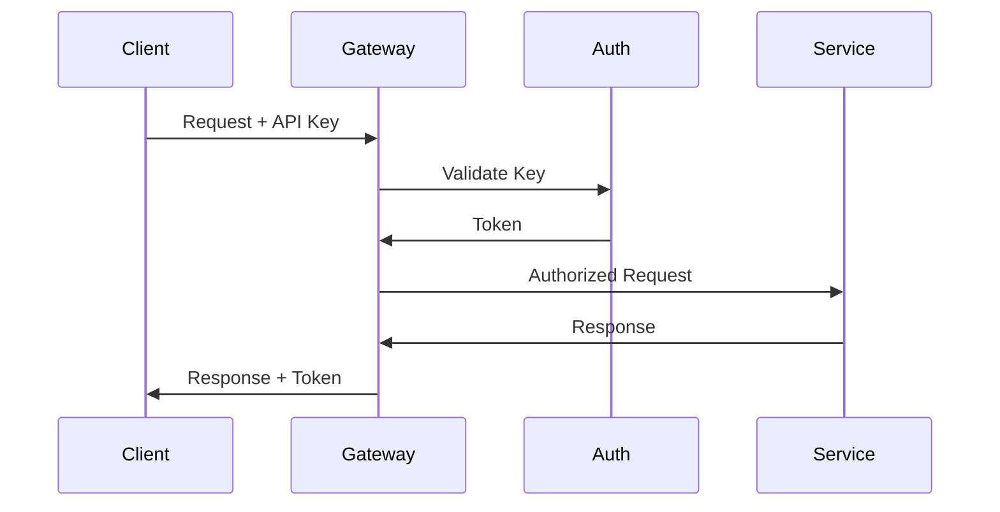

### 3.3.4 Error Handling

| Status Code | Error Category | Response Format |
| --- | --- | --- |
| 400 | Validation Error | `{"error": "validation_failed", "details": [...]}` |
| 401 | Authentication Error | `{"error": "unauthorized", "message": "..."}` |
| 403 | Authorization Error | `{"error": "forbidden", "message": "..."}` |
| 404 | Resource Not Found | `{"error": "not_found", "resource": "..."}` |
| 429 | Rate Limit Exceeded | `{"error": "rate_limit", "retry_after": 123}` |
| 500 | Server Error | `{"error": "internal_error", "reference": "..."}` |

# 4. TECHNOLOGY STACK

## 4.1 PROGRAMMING LANGUAGES

| Platform/Component | Language | Version | Justification |
| --- | --- | --- | --- |
| Core Services | Java | 17 LTS | - Enterprise-grade performance<br>- Strong typing and compile-time safety<br>- Extensive maritime industry libraries |
| API Gateway | Node.js | 18 LTS | - Efficient request handling<br>- Large ecosystem for API management<br>- Excellent async processing |
| Document Processing | Python | 3.9 | - Rich EDIFACT parsing libraries<br>- Machine learning capabilities<br>- Simplified text processing |
| Frontend | TypeScript | 4.9 | - Type safety for large applications<br>- Enhanced developer productivity<br>- Better maintainability |
| Database Scripts | SQL | ANSI | - Standard compliance<br>- Complex query optimization<br>- Portable across databases |

## 4.2 FRAMEWORKS & LIBRARIES

### 4.2.1 Core Frameworks

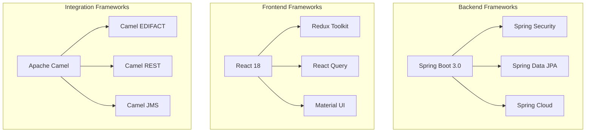

### 4.2.2 Supporting Libraries

| Category | Library | Version | Purpose |
| --- | --- | --- | --- |
| Security | Spring Security | 6.0 | Authentication and authorization |
| ORM | Hibernate | 6.1 | Object-relational mapping |
| API Docs | Swagger | 3.0 | API documentation and testing |
| Messaging | RabbitMQ Client | 5.16 | Message queue integration |
| Monitoring | Micrometer | 1.10 | Application metrics |
| Testing | JUnit Jupiter | 5.9 | Unit and integration testing |
| Build | Maven | 3.9.9 | Popular and complete |

## 4.3 DATABASES & STORAGE

### 4.3.1 Database Architecture

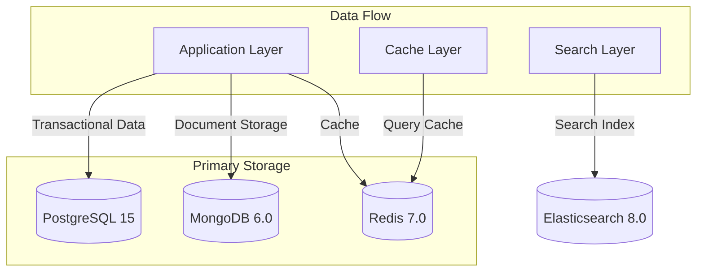

### 4.3.2 Storage Solutions

| Type | Technology | Purpose | Scaling Strategy |
| --- | --- | --- | --- |
| RDBMS | PostgreSQL 15 | Transactional data | Vertical + Read replicas |
| Document Store | MongoDB 6.0 | EDIFACT messages | Horizontal sharding |
| Cache | Redis 7.0 | Session and data cache | Cluster mode |
| Search | Elasticsearch 8.0 | Full-text search | Horizontal scaling |
| File Storage | MinIO | Document storage | Distributed deployment |

## 4.4 THIRD-PARTY SERVICES

### 4.4.1 Service Integration Architecture

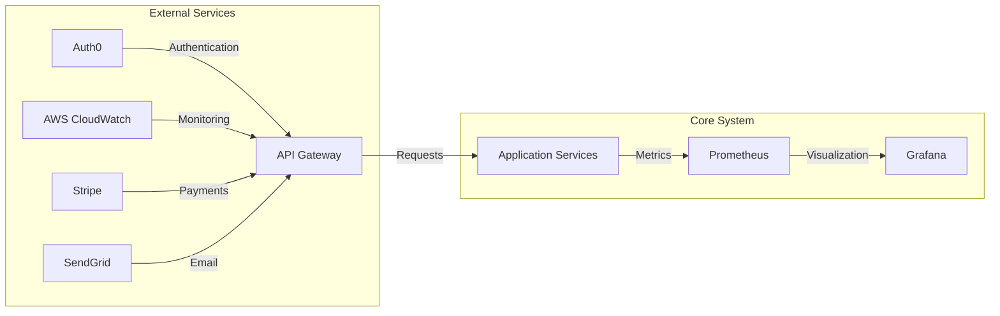

### 4.4.2 Service Matrix

| Service | Provider | Purpose | Integration Method |
| --- | --- | --- | --- |
| Authentication | Auth0 | Identity management | OAuth 2.0/OIDC |
| Monitoring | DataDog | Application monitoring | Agent-based |
| Email | SendGrid | Transactional emails | REST API |
| SMS | Twilio | Mobile notifications | REST API |
| Maps | Google Maps | Location services | JavaScript API |
| Payment | Stripe | Payment processing | REST API |

## 4.5 DEVELOPMENT & DEPLOYMENT

### 4.5.1 Development Pipeline

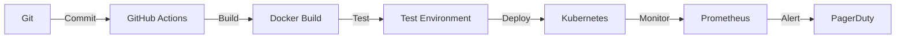

### 4.5.2 Tool Stack

| Category | Tool | Version | Purpose |
| --- | --- | --- | --- |
| Version Control | Git | 2.40 | Source code management |
| CI/CD | GitHub Actions | N/A | Automation pipeline |
| Containerization | Docker | 23.0 | Application packaging |
| Orchestration | Kubernetes | 1.26 | Container orchestration |
| IaC | Terraform | 1.4 | Infrastructure provisioning |
| Monitoring | Prometheus | 2.42 | Metrics collection |
| Logging | ELK Stack | 8.7 | Log aggregation |

### 4.5.3 Environment Configuration

| Environment | Infrastructure | Scaling | Backup Strategy |
| --- | --- | --- | --- |
| Development | AWS EKS | Manual | Daily snapshots |
| Staging | AWS EKS | Auto-scaling | Hourly snapshots |
| Production | AWS EKS | Auto-scaling | Continuous backup |
| DR | AWS EKS | Standby | Cross-region replication |

# 5. SYSTEM DESIGN

## 5.1 User Interface Design

### 5.1.1 Layout Structure

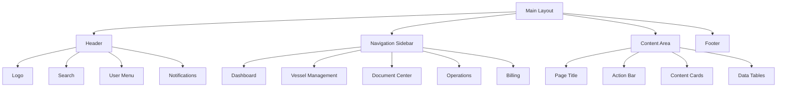

### 5.1.2 Key Screen Layouts

| Screen | Primary Components | Access Level | Key Functions |
| --- | --- | --- | --- |
| Dashboard | - Status widgets<br>- Activity feed<br>- Quick actions<br>- Alerts panel | All Users | - Overview of operations<br>- Critical notifications<br>- Direct action triggers |
| Vessel Management | - Vessel schedule<br>- Berth map<br>- Service requests<br>- Documentation | Port Authority, Terminal Operators | - Berth allocation<br>- Service scheduling<br>- Document submission |
| Document Center | - Document upload<br>- EDIFACT viewer<br>- Status tracking<br>- Validation results | All Users | - Document processing<br>- Message validation<br>- Status monitoring |
| Operations | - Container tracking<br>- Yard view<br>- Gate operations<br>- Resource allocation | Terminal Operators | - Container management<br>- Gate control<br>- Resource scheduling |

### 5.1.3 Responsive Breakpoints

| Breakpoint | Width Range | Layout Adjustments |
| --- | --- | --- |
| Mobile | 320px - 767px | - Single column<br>- Collapsed sidebar<br>- Simplified tables |
| Tablet | 768px - 1023px | - Two columns<br>- Mini sidebar<br>- Scrollable tables |
| Desktop | 1024px - 1439px | - Multi-column<br>- Full sidebar<br>- Full tables |
| Wide | 1440px+ | - Extended layout<br>- Multiple panels<br>- Advanced visualizations |

## 5.2 Database Design

### 5.2.1 Schema Overview


### 5.2.2 Indexing Strategy

| Table | Index Type | Columns | Purpose |
| --- | --- | --- | --- |
| vessel_call | Primary | id | Unique identifier |
| vessel_call | B-tree | (imo_number, eta) | Schedule lookup |
| berth_request | Primary | id | Unique identifier |
| berth_request | B-tree | (start_time, end_time) | Availability check |
| cargo_manifest | Hash | vessel_call_id | Foreign key lookup |
| service_request | B-tree | (requested_time, status) | Service scheduling |

## 5.3 API Design

### 5.3.1 REST Endpoints

| Endpoint | Method | Purpose | Request Format | Response Format |
| --- | --- | --- | --- | --- |
| /api/v1/vessel-calls | POST | Create vessel call | JSON | JSON |
| /api/v1/vessel-calls/{id} | GET | Retrieve vessel details | - | JSON |
| /api/v1/berths | GET | List available berths | Query params | JSON |
| /api/v1/documents | POST | Submit EDIFACT message | EDIFACT | JSON |
| /api/v1/cargo/{id}/track | GET | Track cargo status | - | JSON |

### 5.3.2 API Flow

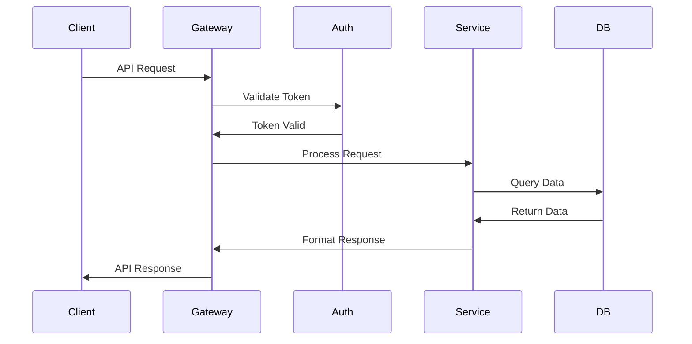

### 5.3.3 WebSocket Events

| Event | Direction | Purpose | Payload Format |
| --- | --- | --- | --- |
| vessel.update | Server→Client | Real-time vessel updates | JSON |
| cargo.status | Server→Client | Cargo status changes | JSON |
| berth.allocated | Server→Client | Berth allocation notification | JSON |
| document.processed | Server→Client | Document processing status | JSON |

### 5.3.4 Error Handling

```mermaid
graph TD
    A[API Request] --> B{Validate Request}
    B -->|Invalid| C[Return 400]
    B -->|Valid| D{Check Auth}
    D -->|Unauthorized| E[Return 401]
    D -->|Authorized| F{Process Request}
    F -->|Error| G[Return 500]
    F -->|Success| H[Return 200]
    F -->|Not Found| I[Return 404]
```

# 6. USER INTERFACE DESIGN

## 6.1 Design System

### 6.1.1 Component Library Key

```
Icons:
[?] - Help/Information tooltip
[$] - Financial/Payment function
[i] - Information display
[+] - Add/Create new item
[x] - Close/Delete/Remove
[<] [>] - Navigation/Pagination
[^] - Upload function
[#] - Menu/Dashboard
[@] - User profile/Account
[!] - Alert/Warning
[=] - Settings/Menu
[*] - Favorite/Important

Input Elements:
[ ] - Checkbox
( ) - Radio button
[...] - Text input field
[v] - Dropdown menu
[Button] - Action button
[====] - Progress bar

Layout Elements:
+--+ - Container border
|  | - Vertical separator
+-- - Hierarchy/Tree view
```

## 6.2 Core Screens

### 6.2.1 Main Dashboard

```
+----------------------------------------------------------+
|  [#] Port Community System             [@] Admin    [=]   |
+----------------------------------------------------------+
|  +----------------+ +-----------------+ +----------------+ |
|  | Vessel Calls   | | Berth Status    | | Alerts [!]    | |
|  | Today: 12      | | Available: 8    | | Critical: 2   | |
|  | Pending: 5     | | Occupied: 4     | | Warning: 3    | |
|  +----------------+ +-----------------+ +----------------+ |
|                                                          |
|  +--------------------------------------------------+   |
|  | Active Operations                            [>]  |   |
|  | +----------------+ +----------------------+        |   |
|  | | Vessel         | | Status              |        |   |
|  | | MAERSK SEALAND | | Loading [====  ] 60%|        |   |
|  | | MSC GENEVA     | | Berthing           |        |   |
|  | +----------------+ +----------------------+        |   |
|  +--------------------------------------------------+   |
|                                                          |
|  +--------------------------------------------------+   |
|  | Recent Documents                            [^]   |   |
|  | - Cargo Manifest #12345 [*]                       |   |
|  | - Customs Declaration #789                        |   |
|  | - Bill of Lading #456                            |   |
|  +--------------------------------------------------+   |
+----------------------------------------------------------+
```

### 6.2.2 Vessel Management

```
+----------------------------------------------------------+
|  [<] Back to Dashboard                     [@] Admin [=]   |
+----------------------------------------------------------+
|  Vessel Management                         [+ New Call]    |
|                                                           |
|  Search: [...........................] [Button: Search]    |
|                                                           |
|  +--------------------------------------------------+    |
|  | Vessel Schedule                                   |    |
|  | +----------+----------+-----------+-------------+ |    |
|  | | Vessel   | ETA      | Berth     | Status      | |    |
|  | |----------+----------+-----------+-------------| |    |
|  | | MSC EVA  | 08:00    | B12       | Approaching | |    |
|  | | COSCO M  | 09:30    | B14       | Scheduled   | |    |
|  | | NYK HERO | 11:45    | B08       | Delayed     | |    |
|  | +----------+----------+-----------+-------------+ |    |
|  +--------------------------------------------------+    |
|                                                           |
|  Filters:                                                 |
|  Status: [v] All                                         |
|  Date Range: [...] to [...]                              |
|  Terminal: [v] All Terminals                             |
+----------------------------------------------------------+
```

### 6.2.3 Document Center

```
+----------------------------------------------------------+
|  [<] Back to Dashboard                     [@] Admin [=]   |
+----------------------------------------------------------+
|  Document Center                    [+ Upload Document]    |
|                                                           |
|  +------------------+ +--------------------------------+  |
|  | Document Types   | | Document List                  |  |
|  | [ ] Manifests    | | +----------+---------+-------+ |  |
|  | [ ] Declarations | | | Doc ID    | Type    | Date  | |  |
|  | [ ] Certificates | | |----------+---------+-------| |  |
|  | [ ] Bills        | | | DOC-123  | Manifest| Today | |  |
|  | [ ] Invoices     | | | DOC-124  | Bill    | Today | |  |
|  +------------------+ | | DOC-125  | Customs | Today | |  |
|                      | +----------+---------+-------+ |  |
|                      +--------------------------------+  |
|                                                          |
|  Document Processing Status:                             |
|  +--------------------------------------------------+   |
|  | Current Processing: [========    ] 80%            |   |
|  | Pending: 3 documents                              |   |
|  | Completed Today: 45 documents                     |   |
|  +--------------------------------------------------+   |
+----------------------------------------------------------+
```

### 6.2.4 Financial Portal

```
+----------------------------------------------------------+
|  [<] Back to Dashboard                     [@] Admin [=]   |
+----------------------------------------------------------+
|  Financial Management                    [+ New Invoice]   |
|                                                           |
|  +-------------------+ +-------------------------------+  |
|  | Quick Actions     | | Outstanding Invoices [$]      |  |
|  | [Button: Pay]     | | Total Due: $125,000          |  |
|  | [Button: Report]  | | Overdue: $15,000             |  |
|  +-------------------+ +-------------------------------+  |
|                                                          |
|  +--------------------------------------------------+   |
|  | Recent Transactions                               |   |
|  | +----------+-----------+----------+-------------+ |   |
|  | | ID       | Service   | Amount   | Status      | |   |
|  | |----------+-----------+----------+-------------| |   |
|  | | INV-001  | Berthing  | $5,000   | Paid        | |   |
|  | | INV-002  | Pilotage  | $2,500   | Pending     | |   |
|  | | INV-003  | Cargo     | $12,000  | Processing  | |   |
|  | +----------+-----------+----------+-------------+ |   |
|  +--------------------------------------------------+   |
|                                                          |
|  Generate Report:                                        |
|  Period: [v] Last 30 Days                               |
|  Type: [v] All Transactions                             |
|  [Button: Generate]                                      |
+----------------------------------------------------------+
```

## 6.3 Mobile Interface

### 6.3.1 Mobile Dashboard

```
+------------------------+
| PCS Mobile    [@] [=] |
+------------------------+
| [#] Dashboard         |
+------------------------+
| Active Vessels (3)    |
| +--------------------+|
| | MSC EVA           ||
| | Status: Loading    ||
| | Progress: [====  ] ||
| +--------------------+|
|                      |
| Recent Alerts [!]    |
| - Berth Change B12   |
| - Document Required  |
|                      |
| Quick Actions:       |
| [Button: Scan QR]    |
| [Button: Documents]  |
| [Button: Payments]   |
+------------------------+
```

## 6.4 Responsive Breakpoints

| Device | Width | Layout Adjustments |
| --- | --- | --- |
| Mobile | \<768px | Single column, collapsed menu |
| Tablet | 768-1024px | Two column, sidebar toggle |
| Desktop | \>1024px | Full layout with sidebars |

## 6.5 Navigation Structure

```mermaid
graph TD
    A[Dashboard] --> B[Vessel Management]
    A --> C[Document Center]
    A --> D[Financial Portal]
    A --> E[Operations]
    
    B --> B1[Vessel Schedule]
    B --> B2[Berth Planning]
    B --> B3[Service Requests]
    
    C --> C1[Upload Documents]
    C --> C2[Document Status]
    C --> C3[Archive]
    
    D --> D1[Invoices]
    D --> D2[Payments]
    D --> D3[Reports]
    
    E --> E1[Gate Operations]
    E --> E2[Yard Management]
    E --> E3[Resource Planning]
```

# 7. SECURITY CONSIDERATIONS

## 7.1 AUTHENTICATION AND AUTHORIZATION

### 7.1.1 Authentication Methods

| Method | Use Case | Implementation |
| --- | --- | --- |
| Username/Password | Standard Web Access | Spring Security with bcrypt hashing |
| OAuth 2.0/OIDC | SSO Integration | Auth0 integration with JWT tokens |
| Client Certificates | System-to-System | mTLS with X.509 certificates |
| API Keys | External API Access | SHA-256 hashed keys with rate limiting |
| MFA | Administrative Access | TOTP using Google Authenticator |

### 7.1.2 Authorization Framework

```mermaid
graph TD
    A[Authentication Request] --> B{Identity Provider}
    B -->|Valid| C[JWT Token]
    B -->|Invalid| D[Access Denied]
    C --> E{Authorization Service}
    E --> F[RBAC Policies]
    E --> G[Resource ACLs]
    F --> H{Permission Check}
    G --> H
    H -->|Allowed| I[Access Granted]
    H -->|Denied| J[Access Denied]
```

### 7.1.3 Role-Based Access Control Matrix

| Role | Vessel Ops | Document Management | Financial | Admin |
| --- | --- | --- | --- | --- |
| Port Authority | Full | Full | Read | Partial |
| Terminal Operator | Full | Create/Read | None | None |
| Shipping Line | Read | Create/Read | Read | None |
| Customs | Read | Full | None | None |
| Finance | None | Read | Full | None |
| System Admin | Read | Read | Read | Full |

## 7.2 DATA SECURITY

### 7.2.1 Data Classification

| Classification | Examples | Security Controls |
| --- | --- | --- |
| Critical | Payment Data, Authentication Credentials | - AES-256 encryption<br>- HSM key storage<br>- Access logging |
| Confidential | Cargo Manifests, Commercial Terms | - AES-256 encryption<br>- Role-based access<br>- Audit trails |
| Internal | Operational Data, Schedules | - TLS in transit<br>- Standard access controls |
| Public | Port Schedules, General Info | - Integrity checks<br>- Basic authentication |

### 7.2.2 Encryption Framework

```mermaid
graph TD
    A[Data Entry] --> B{Classification Check}
    B -->|Critical| C[HSM Encryption]
    B -->|Confidential| D[Software Encryption]
    B -->|Internal| E[TLS Protection]
    C --> F[Encrypted Storage]
    D --> F
    E --> G[Protected Transit]
    F --> H{Access Request}
    H -->|Authorized| I[Decryption]
    H -->|Unauthorized| J[Access Denied]
```

### 7.2.3 Key Management

| Key Type | Storage | Rotation Period | Backup Strategy |
| --- | --- | --- | --- |
| Master Keys | HSM | 1 year | Multi-region HSM sync |
| Data Encryption Keys | Encrypted KeyStore | 90 days | Daily secure backup |
| TLS Certificates | Secure Certificate Store | 1 year | Automated renewal |
| API Keys | Hashed in Database | 180 days | Database backup |

## 7.3 SECURITY PROTOCOLS

### 7.3.1 Network Security

```mermaid
graph TB
    subgraph "DMZ"
        A[WAF] --> B[Load Balancer]
        B --> C[API Gateway]
    end
    
    subgraph "Application Layer"
        C --> D[App Servers]
        D --> E[Cache Servers]
    end
    
    subgraph "Data Layer"
        D --> F[Database]
        D --> G[Document Store]
    end
    
    subgraph "Security Controls"
        H[IDS/IPS]
        I[DDoS Protection]
        J[VPN Gateway]
    end
```

### 7.3.2 Security Monitoring

| Component | Monitoring Method | Alert Threshold | Response Time |
| --- | --- | --- | --- |
| WAF | Real-time logs | 10 attacks/minute | 5 minutes |
| Authentication | Login attempts | 5 failures/minute | Immediate |
| API Gateway | Request analysis | 1000 req/sec/IP | 1 minute |
| Database | Query monitoring | Unusual patterns | 15 minutes |
| File Access | Activity logs | Unauthorized attempts | Immediate |

### 7.3.3 Security Compliance

| Standard | Requirements | Implementation |
| --- | --- | --- |
| ISO 27001 | Information security management | - Regular audits<br>- Policy documentation<br>- Risk assessments |
| GDPR | Data privacy compliance | - Data minimization<br>- Privacy controls<br>- Subject rights management |
| PCI DSS | Payment security | - Network segmentation<br>- Encryption standards<br>- Access controls |
| Local Port Regulations | Regional compliance | - Custom controls<br>- Regular reporting<br>- Authority access |

### 7.3.4 Incident Response

```mermaid
stateDiagram-v2
    [*] --> Detection
    Detection --> Analysis
    Analysis --> Containment
    Containment --> Eradication
    Eradication --> Recovery
    Recovery --> PostIncident
    PostIncident --> [*]
    
    Detection: Automated Detection
    Analysis: Threat Assessment
    Containment: Isolate Threat
    Eradication: Remove Threat
    Recovery: Restore Services
    PostIncident: Review & Update
```

# 8. INFRASTRUCTURE

## 8.1 DEPLOYMENT ENVIRONMENT

### 8.1.1 Environment Strategy

| Environment | Infrastructure | Purpose | Scaling Strategy |
| --- | --- | --- | --- |
| Development | AWS EKS | Feature development and testing | Manual scaling |
| Staging | AWS EKS | UAT and performance testing | Auto-scaling (1-3 nodes) |
| Production | AWS EKS + On-Premise | Live operations | Auto-scaling (3-10 nodes) |
| DR | AWS EKS (Secondary Region) | Disaster recovery | Warm standby |

### 8.1.2 Hybrid Architecture

```mermaid
graph TB
    subgraph "On-Premise Infrastructure"
        A[Local Data Center]
        B[Legacy Systems]
        C[Terminal Equipment]
    end
    
    subgraph "AWS Cloud Primary"
        D[EKS Cluster]
        E[RDS PostgreSQL]
        F[ElastiCache]
        G[S3 Storage]
    end
    
    subgraph "AWS Cloud DR"
        H[DR EKS Cluster]
        I[RDS Replica]
        J[S3 Replica]
    end
    
    A -->|Direct Connect| D
    B -->|VPN| D
    C -->|API Gateway| D
    D --> E
    D --> F
    D --> G
    E -->|Replication| I
    G -->|Replication| J
```

## 8.2 CLOUD SERVICES

### 8.2.1 AWS Service Matrix

| Service | Purpose | Configuration | Backup Strategy |
| --- | --- | --- | --- |
| EKS | Container orchestration | v1.26, managed node groups | Daily cluster snapshots |
| RDS PostgreSQL | Primary database | Multi-AZ, r6g.xlarge | Continuous replication |
| ElastiCache | Session and data caching | Redis 7.0, cluster mode | Cross-AZ replication |
| S3 | Document storage | Standard + Glacier | Cross-region replication |
| CloudFront | CDN and static assets | Global edge locations | N/A |
| Route 53 | DNS management | Active-active routing | Multi-region failover |
| ACM | SSL certificate management | Auto-renewal | N/A |
| KMS | Encryption key management | Automatic rotation | N/A |

### 8.2.2 Resource Allocation

```mermaid
graph TD
    subgraph "Compute Resources"
        A[EKS Node Groups] --> B[Application Pods]
        A --> C[System Pods]
    end
    
    subgraph "Storage Resources"
        D[EBS Volumes] --> E[Container Storage]
        F[S3 Buckets] --> G[Document Storage]
        H[EFS] --> I[Shared Storage]
    end
    
    subgraph "Network Resources"
        J[VPC] --> K[Public Subnets]
        J --> L[Private Subnets]
        M[NAT Gateway] --> L
    end
```

## 8.3 CONTAINERIZATION

### 8.3.1 Container Strategy

| Component | Base Image | Resource Limits | Scaling Policy |
| --- | --- | --- | --- |
| API Gateway | nginx:alpine | 1 CPU, 2GB RAM | HPA 3-10 pods |
| Core Services | openjdk:17-slim | 2 CPU, 4GB RAM | HPA 3-8 pods |
| Document Service | python:3.9-slim | 1 CPU, 2GB RAM | HPA 2-6 pods |
| Frontend | node:18-alpine | 0.5 CPU, 1GB RAM | HPA 2-5 pods |
| Cache | redis:7.0-alpine | 1 CPU, 2GB RAM | Fixed 3 pods |
| Queue | rabbitmq:3.11-management | 1 CPU, 2GB RAM | Fixed 3 pods |

### 8.3.2 Container Security

```mermaid
graph TB
    subgraph "Container Security Layers"
        A[Image Scanning] --> B[Runtime Security]
        B --> C[Network Policies]
        C --> D[Access Control]
        
        E[Harbor Registry] --> A
        F[Falco] --> B
        G[Calico] --> C
        H[RBAC] --> D
    end
```

## 8.4 ORCHESTRATION

### 8.4.1 Kubernetes Architecture

```mermaid
graph TB
    subgraph "EKS Control Plane"
        A[API Server]
        B[Controller Manager]
        C[Scheduler]
        D[etcd]
    end
    
    subgraph "Node Groups"
        E[Application Nodes]
        F[System Nodes]
    end
    
    subgraph "Add-ons"
        G[Cluster Autoscaler]
        H[External DNS]
        I[Cert Manager]
        J[Prometheus]
    end
    
    A --> E
    A --> F
    G --> E
    H --> A
    I --> A
    J --> E
```

### 8.4.2 Kubernetes Resources

| Resource Type | Purpose | Configuration |
| --- | --- | --- |
| Deployments | Application workloads | Rolling updates, resource limits |
| StatefulSets | Stateful services | Persistent storage, ordered deployment |
| DaemonSets | System services | Monitoring, logging agents |
| Services | Internal networking | ClusterIP, LoadBalancer types |
| Ingress | External access | ALB integration, SSL termination |
| ConfigMaps | Configuration | Environment-specific settings |
| Secrets | Sensitive data | Encrypted using KMS |

## 8.5 CI/CD PIPELINE

### 8.5.1 Pipeline Architecture

```mermaid
graph LR
    A[GitHub] -->|Webhook| B[GitHub Actions]
    B -->|Build| C[Container Build]
    C -->|Scan| D[Security Scan]
    D -->|Push| E[Harbor Registry]
    E -->|Deploy| F[ArgoCD]
    F -->|Sync| G[EKS Cluster]
    
    H[SonarQube] -->|Quality| B
    I[Snyk] -->|Vulnerabilities| D
    J[Prometheus] -->|Metrics| K[Alerting]
```

### 8.5.2 Deployment Strategy

| Stage | Tool | Strategy | Rollback Plan |
| --- | --- | --- | --- |
| Build | GitHub Actions | Multi-stage builds | Cache invalidation |
| Test | Jest/JUnit | Parallel execution | Fail fast |
| Security | Snyk/Trivy | Block on High/Critical | Version lockdown |
| Deploy | ArgoCD | Blue/Green deployment | Automatic rollback |
| Monitor | Prometheus/Grafana | Real-time metrics | Alert thresholds |
| Operate | kubectl/Helm | GitOps workflow | State reconciliation |

# APPENDICES

## A.1 ADDITIONAL TECHNICAL INFORMATION

### A.1.1 EDIFACT Message Structure Details

| Message Type | Structure Elements | Validation Rules |
| --- | --- | --- |
| IFTSTA | - UNH (Header)<br>- BGM (Beginning)<br>- DTM (Date/Time)<br>- LOC (Location)<br>- STS (Status)<br>- UNT (Trailer) | - Mandatory header/trailer<br>- Valid status codes<br>- ISO location codes |
| IFTMBC | - UNH (Header)<br>- BGM (Beginning)<br>- RFF (Reference)<br>- TDT (Transport)<br>- UNT (Trailer) | - Valid vessel IMO<br>- Valid booking refs<br>- Required dates |
| COARRI | - UNH (Header)<br>- BGM (Beginning)<br>- EQD (Equipment)<br>- LOC (Location)<br>- UNT (Trailer) | - Valid container numbers<br>- Valid operation codes<br>- Required timestamps |

### A.1.2 System Integration Patterns

```mermaid
graph TB
    subgraph "Integration Patterns"
        A[Request/Response] --> B[REST APIs]
        C[Event-Driven] --> D[Message Queue]
        E[Batch Processing] --> F[File Transfer]
        G[Stream Processing] --> H[Real-time Events]
    end
    
    subgraph "Implementation"
        B --> I[Spring WebFlux]
        D --> J[RabbitMQ]
        F --> K[SFTP Service]
        H --> L[Apache Kafka]
    end
```

### A.1.3 Error Handling Strategy

| Error Category | Handling Mechanism | Recovery Action |
| --- | --- | --- |
| Validation Errors | JSON Schema validation | Return 400 with details |
| Authentication | JWT token validation | Return 401 with refresh token |
| Authorization | RBAC policy check | Return 403 with required roles |
| System Errors | Circuit breaker pattern | Retry with exponential backoff |
| Integration Errors | Dead letter queue | Manual intervention queue |

## A.2 GLOSSARY

| Term | Definition |
| --- | --- |
| Bay Plan | Graphical representation of container positions on a vessel |
| Berth Window | Scheduled time slot for vessel berthing operations |
| Container Seal | Security device used to secure container doors |
| Cut-off Time | Latest time for accepting cargo/containers for a vessel |
| Dangerous Goods | Hazardous materials requiring special handling |
| Draft Survey | Measurement of vessel displacement to determine cargo weight |
| Free Time | Period before storage charges apply |
| Hatch Cover | Watertight covering for vessel cargo holds |
| Lashing | Securing containers on vessel using rods and turnbuckles |
| Load List | Document detailing cargo to be loaded onto vessel |
| Manifest | Detailed list of cargo carried by a vessel |
| Stowage Plan | Plan showing cargo arrangement on vessel |
| Tare Weight | Weight of empty container |
| Terminal | Facility for loading/unloading vessels |
| Transshipment | Transfer of cargo between vessels |

## A.3 ACRONYMS

| Acronym | Full Form |
| --- | --- |
| ACID | Atomic, Consistent, Isolated, Durable |
| API | Application Programming Interface |
| BAPLIE | Bayplan/Stowage Plan Occupied and Empty Locations |
| COARRI | Container Discharge/Loading Report |
| DDoS | Distributed Denial of Service |
| EDI | Electronic Data Interchange |
| ETA | Estimated Time of Arrival |
| ETD | Estimated Time of Departure |
| GDPR | General Data Protection Regulation |
| HSM | Hardware Security Module |
| IFTMBC | International Forwarding and Transport Message Booking Confirmation |
| IFTSTA | International Forwarding and Transport Status |
| IMO | International Maritime Organization |
| JWT | JSON Web Token |
| mTLS | mutual Transport Layer Security |
| OCR | Optical Character Recognition |
| RBAC | Role-Based Access Control |
| REST | Representational State Transfer |
| SFTP | Secure File Transfer Protocol |
| SOLAS | Safety of Life at Sea |
| SSO | Single Sign-On |
| TLS | Transport Layer Security |
| TOS | Terminal Operating System |
| VTS | Vessel Traffic Service |
| WAF | Web Application Firewall |

## A.4 SYSTEM MONITORING METRICS

```mermaid
graph TB
    subgraph "Key Performance Indicators"
        A[System Health] --> B[CPU Usage]
        A --> C[Memory Usage]
        A --> D[Disk I/O]
        A --> E[Network Traffic]
    end
    
    subgraph "Business Metrics"
        F[Operations] --> G[Active Vessels]
        F --> H[Container Moves]
        F --> I[Document Processing]
        F --> J[Gate Transactions]
    end
    
    subgraph "Alerts"
        K[Critical] --> L[System Down]
        K --> M[Security Breach]
        K --> N[Data Loss]
        K --> O[Integration Failure]
    end
```

## A.5 DEPLOYMENT CHECKLIST

| Category | Items |
| --- | --- |
| Infrastructure | - Kubernetes cluster setup<br>- Database initialization<br>- Storage provisioning<br>- Network configuration |
| Security | - SSL certificates<br>- Firewall rules<br>- Access controls<br>- Encryption keys |
| Applications | - Container images<br>- Config maps<br>- Secrets<br>- Service accounts |
| Monitoring | - Prometheus setup<br>- Grafana dashboards<br>- Alert rules<br>- Log aggregation |
| Documentation | - API documentation<br>- Runbooks<br>- Recovery procedures<br>- User guides |