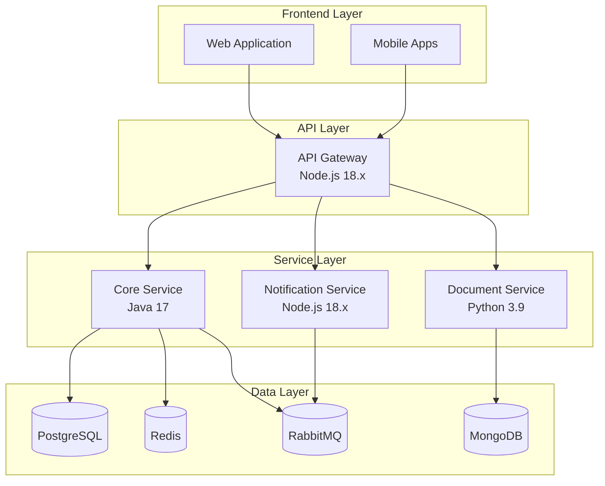

# Port Community System - Backend Services

## Table of Contents
- [Introduction](#introduction)
- [Architecture](#architecture)
- [Services](#services)
- [Security](#security)
- [Development](#development)
- [Operations](#operations)
- [Troubleshooting](#troubleshooting)

## Introduction

The Port Community System (PCS) backend implements a modular monolithic architecture designed for high scalability, reliability, and maintainability. This documentation provides comprehensive guidelines for setup, development, and operations of all backend services.

### Key Features
- Centralized API Gateway for request routing and security
- Core business logic services for port operations
- Document processing for EDIFACT messages
- Real-time notification system
- Comprehensive monitoring and observability
- Enterprise-grade security implementation

## Architecture

### System Components


### Integration Patterns
- REST APIs for synchronous communication
- Message queues for asynchronous processing
- WebSockets for real-time notifications
- Event-driven architecture for system integration

## Services

### API Gateway Service
- **Technology**: Node.js/Express 18.x LTS
- **Purpose**: Request routing, authentication, rate limiting
- **Key Features**:
  - JWT authentication
  - Rate limiting
  - Request validation
  - API documentation (OpenAPI 3.0)
- **Scaling**: Horizontal with load balancer
- **Configuration**: `api-gateway/config.js`
- **API Documentation**: `api-gateway/openapi.yaml`

### Core Service
- **Technology**: Java 17/Spring Boot
- **Purpose**: Business logic and data management
- **Key Features**:
  - Vessel management
  - Berth planning
  - Cargo tracking
  - Billing operations
- **Scaling**: Horizontal with session affinity
- **Configuration**: `core-service/application.yml`
- **Dependencies**: PostgreSQL, Redis, RabbitMQ

### Document Service
- **Technology**: Python 3.9/FastAPI
- **Purpose**: EDIFACT message processing
- **Key Features**:
  - EDIFACT parsing
  - Document validation
  - Format conversion
  - Digital signatures
- **Scaling**: Horizontal with queue-based workload
- **Configuration**: `document-service/config.py`
- **Dependencies**: MongoDB, RabbitMQ

### Notification Service
- **Technology**: Node.js 18.x/Socket.IO
- **Purpose**: Real-time notifications
- **Key Features**:
  - WebSocket connections
  - Event broadcasting
  - Notification persistence
- **Scaling**: Horizontal with sticky sessions
- **Configuration**: `notification-service/config.js`
- **Dependencies**: Redis, RabbitMQ

## Security

### Authentication
- JWT-based authentication
- OAuth 2.0/OpenID Connect support
- MFA for administrative access
- API key authentication for B2B integration

### Authorization
- Role-Based Access Control (RBAC)
- Fine-grained permission system
- Resource-level access control
- Audit logging

### Data Security
- TLS 1.3 for all communications
- AES-256 encryption for sensitive data
- Data classification and handling policies
- Regular security audits

### Compliance
- GDPR compliance measures
- ISO 27001 security controls
- Maritime industry regulations
- Regular compliance auditing

## Development

### Prerequisites
- Docker 23.0+
- Docker Compose 2.17+
- Node.js 18.x LTS
- Java 17 LTS
- Python 3.9
- kubectl 1.26+

### Local Setup
```bash
# Clone repository
git clone https://github.com/organization/port-community-system.git

# Start development environment
cd port-community-system/backend
docker-compose up -d

# Install dependencies
./scripts/install-dependencies.sh

# Initialize database
./scripts/init-database.sh

# Start services
./scripts/start-services.sh
```

### Testing
```bash
# Run unit tests
./scripts/run-tests.sh unit

# Run integration tests
./scripts/run-tests.sh integration

# Run end-to-end tests
./scripts/run-tests.sh e2e
```

### Code Quality
- SonarQube for code analysis
- ESLint/Prettier for JavaScript
- Checkstyle for Java
- Black for Python
- Pre-commit hooks

## Operations

### Deployment
```bash
# Build containers
./scripts/build-containers.sh

# Deploy to Kubernetes
kubectl apply -f kubernetes/

# Verify deployment
kubectl get pods -n pcs
```

### Monitoring

#### Metrics Collection
- Prometheus for metrics collection
- Grafana for visualization
- Custom dashboards for each service
- Business KPI monitoring

#### Logging
- ELK Stack for log aggregation
- Structured logging format
- Log retention policies
- Log-based alerting

#### Alerting
- PagerDuty integration
- Alert severity levels
- On-call rotation
- Incident response procedures

### Scaling
- Horizontal Pod Autoscaling
- Resource quotas and limits
- Load testing procedures
- Capacity planning

## Troubleshooting

### Common Issues
1. API Gateway Connection Issues
   - Check network connectivity
   - Verify SSL certificates
   - Check rate limiting configuration

2. Database Performance
   - Monitor connection pool
   - Check query performance
   - Verify indexing strategy

3. Message Processing Delays
   - Check queue depth
   - Monitor consumer health
   - Verify message routing

### Debug Procedures
```bash
# Check service logs
kubectl logs -f deployment/api-gateway
kubectl logs -f deployment/core-service
kubectl logs -f deployment/document-service
kubectl logs -f deployment/notification-service

# Monitor metrics
kubectl port-forward svc/prometheus 9090:9090
kubectl port-forward svc/grafana 3000:3000

# Debug database
kubectl port-forward svc/postgresql 5432:5432
```

### Support
- Technical Support: support@pcs.com
- Emergency Contact: emergency@pcs.com
- Documentation Portal: docs.pcs.com
- Issue Tracker: jira.pcs.com